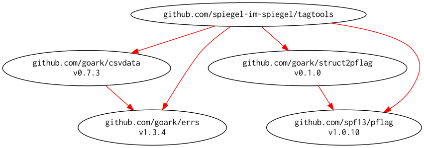

# [tagtools] -- A small CLI for Hugo tag metadata workflows

[](https://github.com/spiegel-im-spiegel/tagtools/actions)
[](https://github.com/spiegel-im-spiegel/tagtools/actions)
[](https://github.com/spiegel-im-spiegel/tagtools/actions)
[](https://raw.githubusercontent.com/spiegel-im-spiegel/tagtools/main/LICENSE)
[](https://github.com/spiegel-im-spiegel/tagtools/releases/latest)

This package is required Go 1.26 or later.

## Build and Install

```
$ go install github.com/spiegel-im-spiegel/tagtools@latest
```

## Binaries

See [latest release](https://github.com/spiegel-im-spiegel/tagtools/releases/latest).

## Usage

See below manuals for usage details.

- English: [manual.md](./manual.md)
- Japanese: [manual.ja.md](./manual.ja.md)

## Test

```
$ task test
```

## Modules Requirement Graph

[](./dependency.png)

[tagtools]: https://github.com/spiegel-im-spiegel/tagtools "spiegel-im-spiegel/tagtools: A small CLI for Hugo tag metadata workflows"
